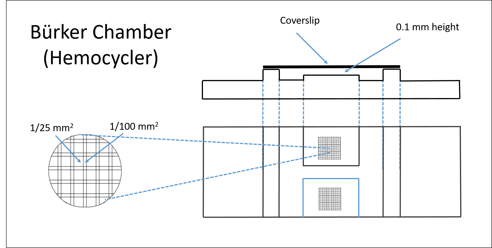

# Cell Counting

## Hemocycler

DESCRIPTION

Microscopic cell counting is more reliable than most other cell counting methods, thus is one of the most widely used methods used (Schisler 1986).

SOLUTIONS

1. Glutaraldehyde 2% in 0.1M PBS:

Stock solutions:

4% Glutaraldehyde solution :

25% Glutaraldehyde         0.12ml/120ul

+ ddH20 to make                                                                    5 ml

0.2M PBS or Cacodylate Buffer (can add sucrose glucose to adjust osmolarity)

Working fixative: 10ml

Add 5ml PBS buffer to freshly prepared 4% Glutaraldehyde solution (1:1).

LITERATURE

Articles:

Schisler, D. O. Comparison of Revised Yeast Counting Methods. Journal of the American Society of Brewing Chemists 44, 81–85 (1986).

Absher, M. Hemocytometer Counting. in Tissue Culture 395–397 (Elsevier, 1973).

Websites:

https://en.wikipedia.org/wiki/Hemocytometer

## Digital

